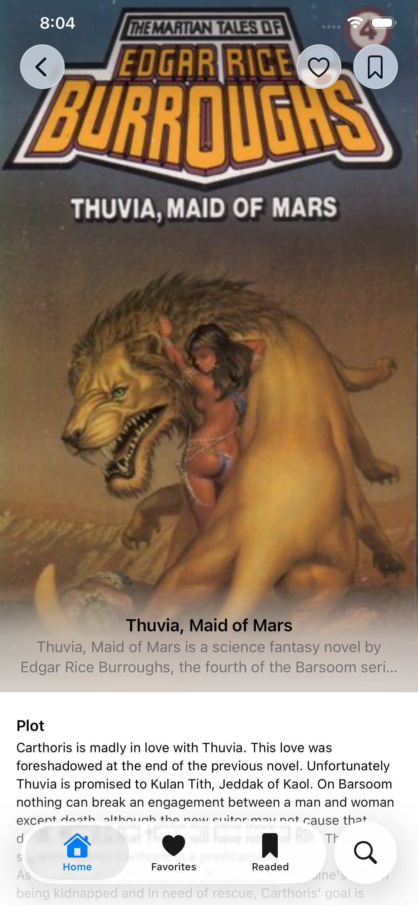
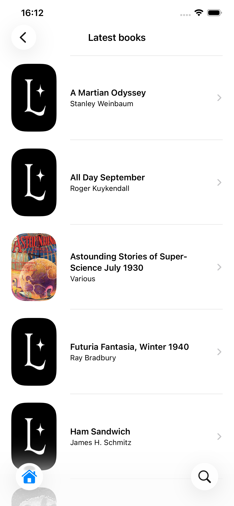
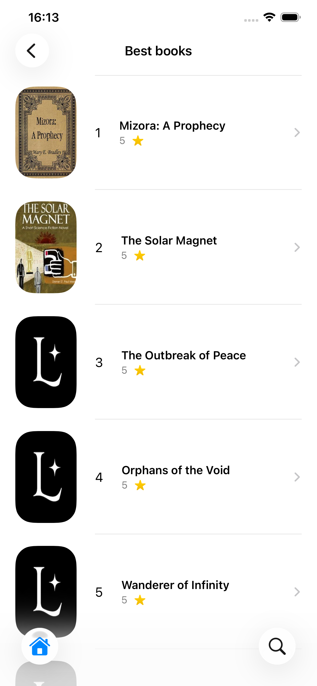
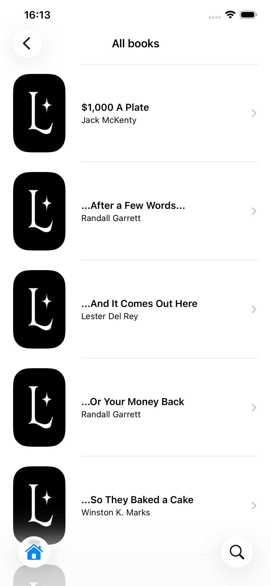
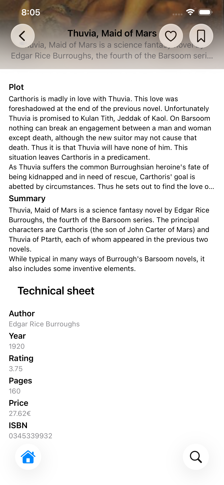
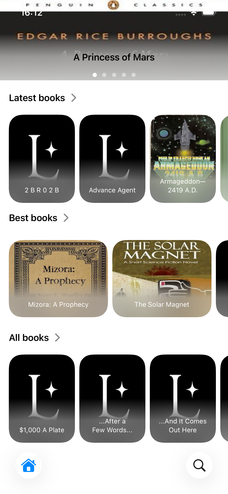
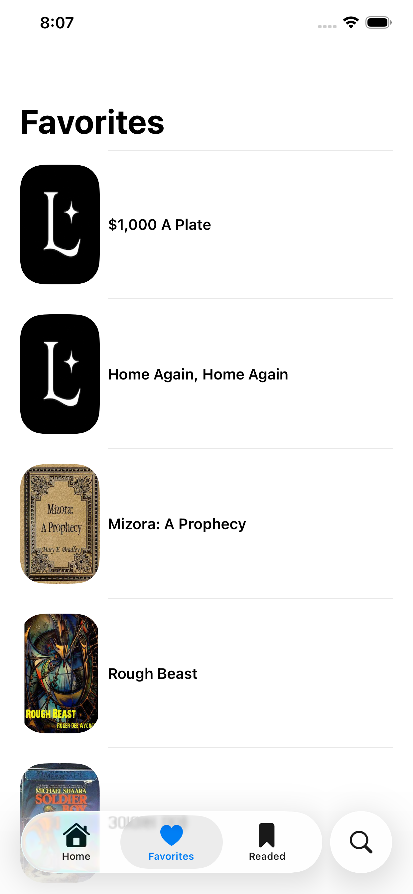
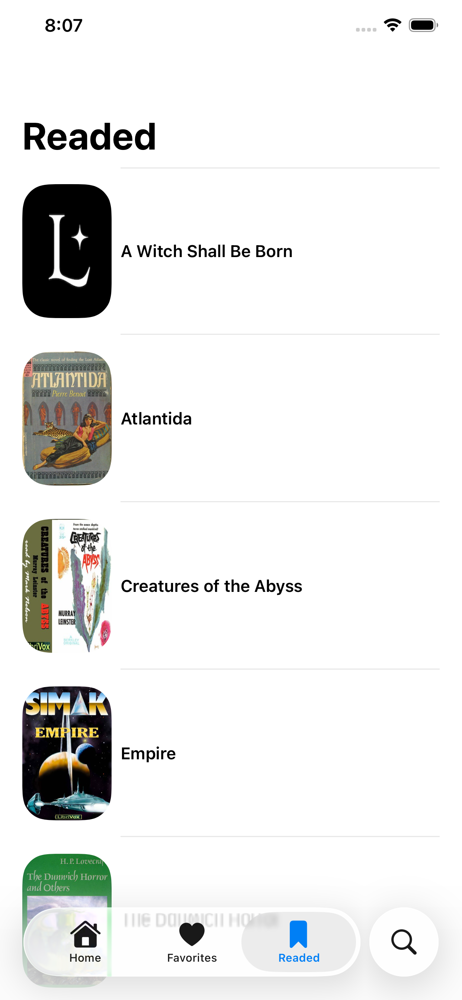
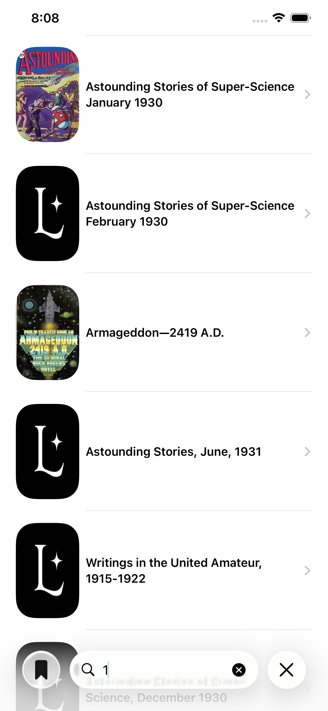

<div align="center">


# Lumexia
### Gestor de Biblioteca de Libros

[](https://swift.org)
[](https://developer.apple.com/swiftui/)
[](https://developer.apple.com/ios/)
[](https://apps.apple.com/app/id6771335712)
[](LICENSE)

**Gestor nativo de biblioteca de libros para iPhone — explora, organiza y sigue tu colección.**  
Revisada y aprobada por Apple. Cero dependencias de terceros.

[](https://apps.apple.com/app/id6771335712)

</div>

---

## Capturas de pantalla

<div align="center">







</div>

<div align="center">







</div>

---

## Funcionalidades

**Explorar y Descubrir**
- Carrusel hero con portadas destacadas en la pantalla de inicio
- Sección de últimas incorporaciones al catálogo
- Ranking de Mejores Libros ordenado por puntuación de la comunidad
- Catálogo completo con portadas obtenidas desde una API REST remota

**Vista de Detalle**
- Portada completa con título, autor y puntuación
- Secciones de argumento (plot) y sinopsis (summary)
- Ficha técnica: autor, año, páginas, precio, ISBN y valoración
- Navegación fluida con transiciones SwiftUI

**Biblioteca Personal**
- Marca cualquier libro como **Favorito** ❤️ o **Leído** 🔖
- Pestañas dedicadas para Favoritos e historial de lectura
- Almacenamiento local persistente — tus datos sobreviven a reinicios de la app
- Eliminación con swipe nativo en ambas listas

**Búsqueda**
- Búsqueda de texto completo contra la API en tiempo real
- Resultados actualizados al instante con async/await

---

## Arquitectura

Lumexia sigue el patrón **MVVM (Model-View-ViewModel)** con una separación limpia entre capas y una capa de red basada en protocolos para máxima testabilidad:

```
Lumexia/
├── Models/              # Codable (Books, Authors) + SwiftData (FavoriteBook, ReadedBook, AuthorData)
├── Model Logic/         # Contenedores @Observable (BooksML, LatestBooksML, AuthorsML)
├── View Models/         # @Observable LibraryVM — lógica de negocio centralizada
├── Views/               # Vistas SwiftUI — cero UIKit
│   ├── MainBooks.swift
│   ├── BestBooks.swift
│   ├── BookDetailView.swift
│   ├── FavoritesBook.swift
│   ├── ReadedBooks.swift
│   ├── AllBooks.swift
│   ├── LatestBooks.swift
│   └── Search.swift
├── Components/          # Componentes reutilizables
│   ├── Cards/
│   ├── Cells/
│   ├── Header/
│   └── Sections/
├── Interactors/         # Protocolo Interactor + implementación NetworkInteractor
├── Interface/           # URLSession extensions, URLRequest, NetworkError, endpoints
├── Extensions/          # ViewModifiers, utilidades
└── Assets.xcassets/
```

**Principios de diseño aplicados:**
- Capa de red basada en protocolo (`Interactor`) — desacoplada y testeable
- ViewModel único con responsabilidad única (`LibraryVM`)
- Las vistas son puramente declarativas — sin lógica dentro de `body`
- SwiftData con `@Relationship` entre modelos para integridad referencial
- Contenedor de modelos SwiftData inyectado vía entorno

---

## Stack Técnico

| Capa | Tecnología |
|---|---|
| Interfaz | SwiftUI |
| Arquitectura | MVVM |
| Concurrencia | async/await · Swift Structured Concurrency |
| Red | URLSession · Protocolo Interactor |
| Serialización | Codable |
| Persistencia local | SwiftData · @Relationship |
| Gestión de dependencias | Ninguna — 100% nativo |

---

## Detalles Técnicos

**Carga paralela de datos con concurrencia estructurada**
```swift
func getData() async {
    do {
        let (books, authors, latestBooks) = try await (
            interactor.getAllBooks(),
            interactor.getAllAuthors(),
            interactor.getLatestBooks()
        )
        await MainActor.run {
            self.books.books = books
            self.authors.authors = authors
            self.latestBooks.latestBooks = latestBooks
        }
    } catch { ... }
}
```

**Persistencia con SwiftData y relaciones entre modelos**
```swift
@Model
final class FavoriteBook {
    @Attribute(.unique) var id: Int
    var title: String
    @Relationship(deleteRule: .nullify) var author: AuthorData?
    var rating: Double?
    var cover: URL?
}

@Model
final class AuthorData {
    var id: UUID
    var name: String
    @Relationship(inverse: \FavoriteBook.author) var books: [FavoriteBook]?
}
```

**Capa de red basada en protocolo — desacoplada y testeable**
```swift
protocol Interactor {
    func getAllBooks() async throws -> [Books]
    func getAllAuthors() async throws -> [Authors]
    func getLatestBooks() async throws -> [Books]
    func findBooks(find: String) async throws -> [Books]
}
```

**Decodificación Codable con tipado seguro — JSONSerialization nunca usado**
```swift
struct Books: Codable, Identifiable, Hashable {
    let id: Int
    let title: String
    let author: UUID
    let year: Int
    let rating: Double?
    let pages: Int?
    let cover: URL?
    let plot: String?
    let summary: String?
}
```

---

## Requisitos

| Requisito | Versión |
|---|---|
| iOS | 26.0+ |
| Xcode | 16.0+ |
| Swift | 5.9+ |
| Dispositivo | iPhone |

---

## Compilar y Ejecutar

1. Clona el repositorio
```bash
git clone https://github.com/YerayCastro/Lumexia.git
```
2. Abre `Lumexia.xcodeproj` en Xcode 16 o superior
3. Selecciona un simulador o dispositivo con iOS 26+
4. Pulsa `⌘R` para compilar y ejecutar

Sin dependencias externas que resolver — el proyecto compila de inmediato.

---

## App Store

Lumexia está disponible en el App Store, revisada y aprobada por Apple.

[](https://apps.apple.com/app/id6771335712)

---

## Autor

**Yeray Castro Jiménez** — Desarrollador iOS  
Formado en Apple Coding Academy · Swift Developer Program 2023

[](https://www.linkedin.com/in/yeray-castro-jimenez/)
[](https://yeraycastro.github.io)
[](mailto:yeraycastro9@gmail.com)

---

## Licencia

Este proyecto está bajo la Licencia MIT — consulta el archivo [LICENSE](LICENSE) para más detalles.

